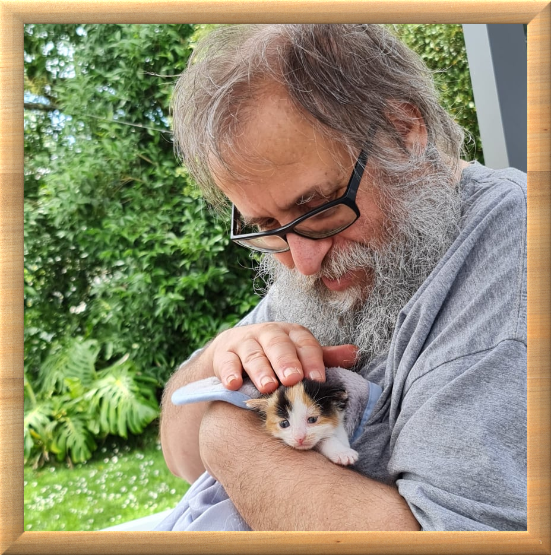

<!-- @format -->

<!--

Community: hive-106316

Title: Introducing my selfhosting project for 2022

Tags: intro-post, introduceyourself, heyhaveyamet, blog, actuallyautistic, splinterlands, theterminal, palnet

-->

<!-- post begins -->

# Introducing my selfhosting project for 2022

Body text summary goes here. Write it last!

## Who I am

Greetings,
I am [@frittro](https://ecency.com/@frittro), a newcomer to the

HIVE blockchain. I live in Auckland, New Zealand. I am an _"older adult"_
(or an _"elder geek"_, or _"silver surfer"_, but never _"ok boomer"_, please). I
am married for 21 years to `@frittni`, with no children (unfortunately), and
currently no pets of our own either. We have close friends who run a cattery
though, so we enjoy their company, at least. I am
[ #actuallyautistic](https://ecency.com/created/actuallyautistic),
I have type 2
[ diabetes](https://ecency.com/created/diabetes),
and a
[ cardiac](https://ecency.com/created/cardiac)
condition, with stents in my heart. I also have a
[ major depressive disorder](https://ecency.com/created/depression).
What this all means, and how it all works together, is something like this...

My wife `@frittni` was born with

Spina Bifida, and she manages pretty well on crutches, or a walker, or
sometimes in a wheelchair. We are both in the 50+ age bracket, and both are
welfare beneficiaries at present. `@frittni` has a teriary degree, and has
experience in radio broadcasting. I never completed my tertiary education, due
to (at the time) undiagnosed Autism-related issues, and depression. I have a
varied employment history, including deckhanding on a big game fishing vessel;
fisheries research; horticultural contracting; I was a business owner of a small
computer repair business; adult educator in a
<abbr title="Private Training Establishment">PTE</abbr> teaching computing
subjects; and corrections / offender monitoring for those people wearing
"traceable ankle jewellery" out in the community. I've done all sorts of things
over the years.

In short, here is
[my profile from  Mastodon](https://mastodon.nzoss.nz/@frittro),
a freedom-respecting social network which functions similar to

Twitter...

> I am an 🧩 #autistic, 💉 #diabetic, 😞 #depressed, 👴🏽 #elderly #male 🤓 #geek,
> who was raised as a ✝️ #Christian but is now ⚛️ #nonreligious, is 👈🏽 #leftist
> leaning but not an extremist, 👫🏽 straight but not prejudiced, happily 💍
> #married person, who lives in 🇳🇿 #newzealand, and loves 🐈 #cats and 🐕 #dogs
> equally. I support all ♾️ #diversity, particularly of 🧠 #neurodiversity and
> ♿ #disability, which I often refer to as "diverse function".

## Who I was

I was [@trisquelwhare](https://ecency.com/@trisquelwhare), an account migrated
to the

HIVE blockchain from the

Steem blockchain. I was active on there from late 2017 through most of
2018, and got hooked on SteemMonsters (SM), which is now called Splinterlands. I
disappeared in late 2018 with health issues, and tried to make a comeback in
2019, but still wasn't really well enough. I'm still not 100% better, and my
cardiologist says that I probably never will be, but at least I'm starting to
get back into some of the things that I could do back then.

I
used to be in a SM guild called

ContestKings, where I was the scribe, responsible for generating the
guild member rankings and statistics graphs, along with a curation trail of
SM-themed contest posts. I didn't run it, I was just the scribe, doing the
slog-work of generating the articles. I got "paid" in SM cards, and built up
quite [a nice collection](https://peakmonsters.com/@trisquelwhare/cards) of
Alpha and Beta edition SM cards! 😜 I was very active in the SM community back
then, and participated in several of the SteemMonster Show events which were run
by [@coruscate](https://ecency.com/@coruscate/) and
[@littlescribe](https://ecency.com/@littlescribe). I also did a bit of graphic
design stuff for the SteemMonster Show back in the day, too. Those were some fun
times. I fondly remember episodes of the "SteemMonster Tavern", which I even
participated in ocassionally. What a blast that was! Was that part of the
SteemMonster Show, or was it part of The Playhouse, with
[@carrieallen](https://ecency.com/@carrieallen) and
[@chrisroberts](https://ecency.com/@chrisroberts)? Gosh, I'm getting confused
now, hehe. But I certainly have some very fond memories of those days. A large
part of my SM card collection came from the generosity of
[@clove71](https://ecency.com/@clove71), who always was such a kind and helpful
person. I understand that she is still at it, and is arguably the biggest
account in Splinterlands. Nice!

Back
in those days, I also used to play a lot of Steempunk.net,

## Why I am here now

## Images

- Bulleted image source list goes here.

<!-- post ends -->
